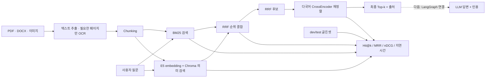

# gongo-rag

한국어 정부 지원사업 공고문을 검색하고, **근거를 인용해 답하며 근거가 부족하면 거절하는 RAG**를 만드는 프로젝트입니다.

처음 읽는다면 [RAG 전체 작업 지도](docs/RAG_WORKFLOW.md)에서 완료한 일, 남은 일과
파일 입력부터 최종 답변·평가·배포까지의 순서를 먼저 확인하세요.

이 저장소의 목적은 단순 데모가 아니라 다음 세 가지를 증명하는 것입니다.

1. 검색과 답변 품질을 분리해 측정할 수 있다.
2. 한국어 문서 검색의 실패를 숫자와 사례로 설명할 수 있다.
3. 직접 구현한 기준선에서 현업형 RAG 구조로 발전시킬 수 있다.

## 현재 상태

> **v0 기준선 구현 완료, 현업형 구조로 전환 중**

| 영역 | 현재 구현 | 다음 단계 |
|---|---|---|
| 문서 처리 | PDF·DOCX·이미지 추출, 문단 우선 chunking, LangChain Document 변환 | 색인 수명 관리 |
| 검색 | Kiwi BM25 + E5/Chroma + chunk ID 기반 RRF 통합 검색 | 검색 실패 유형 확장 |
| 재정렬 | BGE + 후보 7개 최종 선택, Cohere adapter 선택 제공 | LangGraph 연결 |
| 답변 | LLM prompt, 숫자 근거 일치 검사, `정보 없음` 처리 | LangGraph 재검색·거절 흐름 |
| 평가 | dev로 설정 선택·test 1회 완료, Hit@k·MRR·nDCG·지연 리포트 | Ragas + 사람 답변 평가 |
| 서비스 | Streamlit 문서 업로드·추출·질문 데모 | FastAPI + Docker |

최초 후보 10개 기준 reranker는 dev normal 20문항에서 Hit@1 0.80, MRR 0.90,
CPU 평균 약 6.28초였습니다. 후보 7개는 Hit@1 0.85, MRR 0.925를 기록하면서
평균 지연을 약 4.20초로 33.1% 줄였습니다.

같은 후보 7개로 568M BGE와 118M MiniLM을 다시 비교하자 MiniLM은 약 9.8배
빨랐지만 Hit@1이 0.85에서 0.70으로 떨어졌습니다. 따라서 품질 우선 기본값은
BGE로 유지하고 MiniLM은 속도 우선 선택지로만 기록했습니다.

Cohere `rerank-v4.0-pro`도 같은 평가기에 연결했습니다. Cohere를 선택하면 질문과
RRF 후보 본문 7개가 외부 API로 전송되며 API 키가 필요합니다. 키가 없어 실제
비교는 보류했고, 현재 포트폴리오의 최종 검색 설정은 로컬 BGE로 잠갔습니다.

잠가 둔 test normal 10문항을 한 번 실행한 결과 BGE reranker는 Hit@1 0.80,
Hit@3·5 0.90, MRR 0.85였습니다. `q026`은 자동 평가에서 실패했지만 BM25 검색
1위에 같은 제출 마감일이 있어 사람이 보면 답할 수 있는 false negative였습니다.
수치는 사후 수정하지 않고 그대로 보존합니다.

## 현재 아키텍처



목표 구조는 `LangChain → BM25/Chroma → RRF → reranker → LangGraph → Ragas`입니다. 각 도구를 추가하기 전에 현재 기준선을 보존하고, 같은 평가셋으로 개선 여부를 확인합니다.

## 실행

Windows PowerShell 기준입니다.

```powershell
python -m venv .venv
.venv\Scripts\Activate.ps1
pip install -r requirements.txt

python tests\test_chunker.py
python tests\test_bm25.py
python tests\test_bm25_retriever.py
python tests\test_vector_search.py
python tests\test_hybrid_search.py
python tests\test_reranker.py
python tests\test_evaluate.py
python tests\test_retrieval_evaluation.py
python tests\test_rag_answer.py
python tests\test_document_ingestion.py
python tests\test_document_chunking.py
python tests\test_document_upload_ui.py
```

검색 결과만 확인할 때는 API 키가 없어도 됩니다.

### 파일을 올려 글자로 바꾸기

```powershell
streamlit run app.py
```

브라우저의 `1. 문서 넣기` 탭에서 일반 PDF, 스캔 PDF, DOCX, 이미지를
올릴 수 있습니다. 일반 PDF와 DOCX는 바로 읽고, 스캔 PDF와 이미지는
Tesseract OCR로 한국어와 영어를 읽습니다. OCR 엔진 설치와 파일별 제한은
[1번 작업: 파일 속 글자 꺼내기](docs/INGESTION.md)에 쉬운 설명과 면접 대비
기술 내용을 함께 정리했습니다.

추출 결과를 미리 보고 TXT로 받을 수 있습니다. 이어서 같은 화면에서 문단
우선 또는 고정 길이 방식으로 chunk를 만들고 metadata를 확인할 수 있습니다.
자세한 학습 내용은
[2번 작업: 긴 글을 검색용 조각으로 나누기](docs/CHUNKING.md)에 정리했습니다.
만든 chunk는 Kiwi 형태소 분석을 사용하는 BM25로 바로 검색할 수 있습니다.
검색 원리, 한국어 조사 처리와 면접 대비 내용은
[3번 작업: 질문과 같은 단어가 있는 조각 찾기](docs/BM25.md)에 정리했습니다.
같은 chunk를 한국어 지원 E5 모델로 embedding하고 로컬 Chroma에 저장해
의미로 검색할 수도 있습니다. 자세한 내용은
[4번 작업: 같은 뜻의 문서 조각 찾기](docs/VECTOR_SEARCH.md)에 정리했습니다.
두 검색 결과는 공통 chunk ID와 순위를 사용해 RRF로 합칩니다. 원점수를
직접 더하지 않는 이유와 실제 성공·실패 사례는
[5번 작업: 두 검색기의 순위를 합치기](docs/RRF.md)에 정리했습니다.
RRF 상위 후보는 한국어를 포함한 다국어 CrossEncoder가 질문과 본문을 함께
읽고 다시 정렬합니다. 실제 한국어 PDF의 개선·실패 사례와 면접 대비 내용은
[6번 작업: 질문과 후보를 함께 읽어 다시 정렬하기](docs/RERANKER.md)에
정리했습니다.
실제 공고문 3개에서 만든 고정 질문으로 네 검색기를 같은 조건에서 비교하는 방법과
dev 결과는 [7번 작업: 같은 시험지로 검색기 성적 비교하기](docs/EVALUATION.md)에
정리했습니다. 사람이 읽는 실제 결과는
[dev 검색 평가 리포트](experiments/retrieval-evaluation-dev.md)에서 바로 볼 수
있습니다.
후보 10·7·5개의 속도와 정확도를 비교해 7개를 선택한 근거는
[reranker 후보 수 비교](experiments/reranker-candidate-comparison-dev.md)에
남겼습니다.
같은 후보 7개에서 BGE와 작은 MiniLM의 품질·속도·메모리를 비교한 결과와
모델 선택 근거는
[작은 로컬 reranker 비교](experiments/reranker-model-comparison-dev.md)에
남겼습니다.
최종 test 결과와 `q026` 수동 검토는
[test 검색 평가 리포트](experiments/retrieval-evaluation-test.md)에 남겼습니다.

```powershell
python src\run_retrieval_evaluation.py --split dev
```

선택적으로 Cohere를 비교할 때만 별도 API 키를 사용합니다. `.env.example`을
`.env`로 복사하고 `COHERE_API_KEY`만 채우면 평가 CLI가 자동으로 읽습니다.
`.env`는 git에서 제외되며 키를 코드나 실험 결과에 저장하지 않습니다.

```powershell
Copy-Item .env.example .env
# .env 파일에서 COHERE_API_KEY 값만 채우기
python src\run_retrieval_evaluation.py `
  --split dev `
  --systems reranker `
  --ks 1,3,5 `
  --reranker-provider cohere `
  --rerank-candidates 7 `
  --output experiments\reranker-model-cohere-dev.json `
  --markdown-output experiments\reranker-model-cohere-dev.md
```

무료 평가 키는 rate limit이 있으므로 품질 확인에는 쓸 수 있지만 지연 시간은
production 환경과 같다고 해석하지 않습니다.

```powershell
python src\rag_answer.py "신청 자격이 어떻게 되나요?"
```

답변 생성과 Streamlit 데모를 실행할 때는 환경 변수에 API 키를 설정합니다.

```powershell
$env:OPENAI_API_KEY = "your-api-key"
streamlit run app.py
```

## 평가 원칙

- 골든셋은 실험 도중 정답을 맞추기 위해 수정하지 않습니다.
- 설정은 dev로 골랐고 test는 한 번 실행했습니다. 이제 test에 맞춰 다시 튜닝하지 않습니다.
- chunk 크기, tokenizer, 검색기처럼 **한 번에 하나의 변수만** 바꿉니다.
- Hit@1·3·5·10, MRR, nDCG와 지연 시간을 함께 봅니다.
- 검색 실패, 답변 실패, 원문 데이터 문제를 따로 기록합니다.
- Ragas 점수만 믿지 않고 한국어 질문·근거·답변을 사람이 함께 확인합니다.

## 저장소 구조

```text
gongo-rag/
├── app.py                 # 업로드·추출·질문 Streamlit 데모
├── .chroma/               # 로컬 vector DB (git 제외)
├── data/                  # 골든셋
├── docs/raw/              # 원본 공고문 PDF
├── docs/text/             # 추출 텍스트
├── experiments/           # 비교 실험과 결정 기록
├── notes/                 # 관찰 기록
├── src/                   # 추출·chunking·BM25·Chroma·RRF·reranker·답변·평가
└── tests/                 # 핵심 로직 자가 검증
```

전체 학습 순서와 “무엇을 왜 만드는지”는
[RAG 전체 작업 지도](docs/RAG_WORKFLOW.md)에 한 문서로 정리합니다.

## 다음 마일스톤

1. LangGraph 재검색·근거 인용·안전한 거절 흐름 구현하기
2. Ragas·수동 검토를 포함한 답변 평가표 작성하기
3. FastAPI·Docker와 재현 가능한 실행 환경 제공하기
4. 최종 포트폴리오 README와 데모 화면 정리하기
