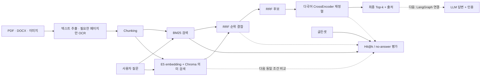

# gongo-rag

한국어 정부 지원사업 공고문을 검색하고, **근거를 인용해 답하며 근거가 부족하면 거절하는 RAG**를 만드는 프로젝트입니다.

이 저장소의 목적은 단순 데모가 아니라 다음 세 가지를 증명하는 것입니다.

1. 검색과 답변 품질을 분리해 측정할 수 있다.
2. 한국어 문서 검색의 실패를 숫자와 사례로 설명할 수 있다.
3. 직접 구현한 기준선에서 현업형 RAG 구조로 발전시킬 수 있다.

## 현재 상태

> **v0 기준선 구현 완료, 현업형 구조로 전환 중**

| 영역 | 현재 구현 | 다음 단계 |
|---|---|---|
| 문서 처리 | PDF·DOCX·이미지 추출, 문단 우선 chunking, LangChain Document 변환 | 색인 수명 관리 |
| 검색 | Kiwi BM25 + E5/Chroma + chunk ID 기반 RRF 통합 검색 | 고정 질문으로 단계별 품질 비교 |
| 재정렬 | `BAAI/bge-reranker-v2-m3` 로컬 CrossEncoder | Cohere와 품질·속도·비용 비교 |
| 답변 | LLM prompt, 숫자 근거 일치 검사, `정보 없음` 처리 | LangGraph 재검색·거절 흐름 |
| 평가 | 골든셋 36문항, Hit@k, no-answer 평가 | dev/test 분리 + Ragas |
| 서비스 | Streamlit 문서 업로드·추출·질문 데모 | FastAPI + Docker |

기존 v0 BM25의 Hit@3 탐색 결과는 일반 질문 기준 **16/30(53.3%)**입니다.
골든셋을 dev/test로 나누기 전 수치이고 새 Kiwi BM25·Chroma를 같은 조건으로
아직 비교하지 않았으므로 최종 성능으로 사용하지 않습니다.

## 현재 아키텍처



목표 구조는 `LangChain → BM25/Chroma → RRF → reranker → LangGraph → Ragas`입니다. 각 도구를 추가하기 전에 현재 기준선을 보존하고, 같은 평가셋으로 개선 여부를 확인합니다.

## 실행

Windows PowerShell 기준입니다.

```powershell
python -m venv .venv
.venv\Scripts\Activate.ps1
pip install -r requirements.txt

python tests\test_chunker.py
python tests\test_bm25.py
python tests\test_bm25_retriever.py
python tests\test_vector_search.py
python tests\test_hybrid_search.py
python tests\test_reranker.py
python tests\test_evaluate.py
python tests\test_rag_answer.py
python tests\test_document_ingestion.py
python tests\test_document_chunking.py
python tests\test_document_upload_ui.py
```

검색 결과만 확인할 때는 API 키가 없어도 됩니다.

### 파일을 올려 글자로 바꾸기

```powershell
streamlit run app.py
```

브라우저의 `1. 문서 넣기` 탭에서 일반 PDF, 스캔 PDF, DOCX, 이미지를
올릴 수 있습니다. 일반 PDF와 DOCX는 바로 읽고, 스캔 PDF와 이미지는
Tesseract OCR로 한국어와 영어를 읽습니다. OCR 엔진 설치와 파일별 제한은
[1번 작업: 파일 속 글자 꺼내기](docs/INGESTION.md)에 쉬운 설명과 면접 대비
기술 내용을 함께 정리했습니다.

추출 결과를 미리 보고 TXT로 받을 수 있습니다. 이어서 같은 화면에서 문단
우선 또는 고정 길이 방식으로 chunk를 만들고 metadata를 확인할 수 있습니다.
자세한 학습 내용은
[2번 작업: 긴 글을 검색용 조각으로 나누기](docs/CHUNKING.md)에 정리했습니다.
만든 chunk는 Kiwi 형태소 분석을 사용하는 BM25로 바로 검색할 수 있습니다.
검색 원리, 한국어 조사 처리와 면접 대비 내용은
[3번 작업: 질문과 같은 단어가 있는 조각 찾기](docs/BM25.md)에 정리했습니다.
같은 chunk를 한국어 지원 E5 모델로 embedding하고 로컬 Chroma에 저장해
의미로 검색할 수도 있습니다. 자세한 내용은
[4번 작업: 같은 뜻의 문서 조각 찾기](docs/VECTOR_SEARCH.md)에 정리했습니다.
두 검색 결과는 공통 chunk ID와 순위를 사용해 RRF로 합칩니다. 원점수를
직접 더하지 않는 이유와 실제 성공·실패 사례는
[5번 작업: 두 검색기의 순위를 합치기](docs/RRF.md)에 정리했습니다.
RRF 상위 후보는 한국어를 포함한 다국어 CrossEncoder가 질문과 본문을 함께
읽고 다시 정렬합니다. 실제 한국어 PDF의 개선·실패 사례와 면접 대비 내용은
[6번 작업: 질문과 후보를 함께 읽어 다시 정렬하기](docs/RERANKER.md)에
정리했습니다.

```powershell
python src\rag_answer.py "신청 자격이 어떻게 되나요?"
```

답변 생성과 Streamlit 데모를 실행할 때는 환경 변수에 API 키를 설정합니다.

```powershell
$env:OPENAI_API_KEY = "your-api-key"
streamlit run app.py
```

## 평가 원칙

- 골든셋은 실험 도중 정답을 맞추기 위해 수정하지 않습니다.
- chunk 크기, tokenizer, 검색기처럼 **한 번에 하나의 변수만** 바꿉니다.
- Hit@1·3·5와 후보 Hit@20으로 검색을 먼저 평가합니다.
- 검색 실패, 답변 실패, 원문 데이터 문제를 따로 기록합니다.
- Ragas 점수만 믿지 않고 한국어 질문·근거·답변을 사람이 함께 확인합니다.

## 저장소 구조

```text
gongo-rag/
├── app.py                 # 업로드·추출·질문 Streamlit 데모
├── .chroma/               # 로컬 vector DB (git 제외)
├── data/                  # 골든셋
├── docs/raw/              # 원본 공고문 PDF
├── docs/text/             # 추출 텍스트
├── experiments/           # 비교 실험과 결정 기록
├── notes/                 # 관찰 기록
├── src/                   # 추출·chunking·BM25·Chroma·RRF·reranker·답변·평가
└── tests/                 # 핵심 로직 자가 검증
```

전체 학습 순서와 “무엇을 왜 만드는지”는 [RAG 전체 지도](https://github.com/hamjinoo/ai-engineer-study/blob/main/rag/RAG-%EC%A0%84%EC%B2%B4%EC%A7%80%EB%8F%84.md)에 정리합니다.

## 다음 마일스톤

1. 고정 질문으로 BM25·Chroma·RRF·reranker 품질과 지연 비교하기
2. 로컬 CrossEncoder와 Cohere Rerank 비교하기
3. LangGraph 재검색·거절 흐름 구현하기
4. Ragas·수동 검토를 포함한 답변 평가표 작성하기
5. FastAPI·Docker와 재현 가능한 실행 환경 제공하기
