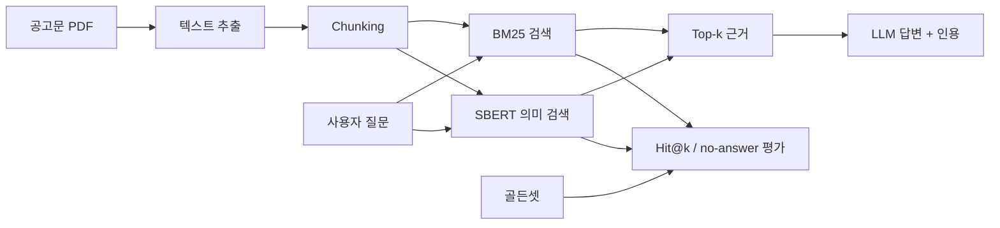

# gongo-rag

한국어 정부 지원사업 공고문을 검색하고, **근거를 인용해 답하며 근거가 부족하면 거절하는 RAG**를 만드는 프로젝트입니다.

이 저장소의 목적은 단순 데모가 아니라 다음 세 가지를 증명하는 것입니다.

1. 검색과 답변 품질을 분리해 측정할 수 있다.
2. 한국어 문서 검색의 실패를 숫자와 사례로 설명할 수 있다.
3. 직접 구현한 기준선에서 현업형 RAG 구조로 발전시킬 수 있다.

## 현재 상태

> **v0 기준선 구현 완료, 현업형 구조로 전환 중**

| 영역 | 현재 구현 | 다음 단계 |
|---|---|---|
| 문서 처리 | PDF 텍스트 추출, 고정 길이·문단 chunking | 구조·metadata 보강 |
| 검색 | 직접 구현한 BM25, 한국어 SBERT 의미 검색 | Kiwi BM25 + ChromaDB + RRF |
| 재정렬 | 미구현 | multilingual CrossEncoder, 필요 시 Cohere 비교 |
| 답변 | LLM prompt, 숫자 근거 일치 검사, `정보 없음` 처리 | LangGraph 재검색·거절 흐름 |
| 평가 | 골든셋 36문항, Hit@k, no-answer 평가 | dev/test 분리 + Ragas |
| 서비스 | Streamlit 데모 | FastAPI + Docker |

현재 BM25 Hit@3의 탐색용 결과는 일반 질문 기준 **16/30(53.3%)**입니다. 골든셋을 dev/test로 나누기 전 수치이므로 최종 성능이나 모델 간 공정 비교 결과로 사용하지 않습니다.

## 현재 아키텍처



목표 구조는 `LangChain → BM25/Chroma → RRF → reranker → LangGraph → Ragas`입니다. 각 도구를 추가하기 전에 현재 기준선을 보존하고, 같은 평가셋으로 개선 여부를 확인합니다.

## 실행

Windows PowerShell 기준입니다.

```powershell
python -m venv .venv
.venv\Scripts\Activate.ps1
pip install -r requirements.txt

python tests\test_chunker.py
python tests\test_bm25.py
python tests\test_evaluate.py
python tests\test_rag_answer.py
```

검색 결과만 확인할 때는 API 키가 없어도 됩니다.

```powershell
python src\rag_answer.py "신청 자격이 어떻게 되나요?"
```

답변 생성과 Streamlit 데모를 실행할 때는 환경 변수에 API 키를 설정합니다.

```powershell
$env:OPENAI_API_KEY = "your-api-key"
streamlit run app.py
```

## 평가 원칙

- 골든셋은 실험 도중 정답을 맞추기 위해 수정하지 않습니다.
- chunk 크기, tokenizer, 검색기처럼 **한 번에 하나의 변수만** 바꿉니다.
- Hit@1·3·5와 후보 Hit@20으로 검색을 먼저 평가합니다.
- 검색 실패, 답변 실패, 원문 데이터 문제를 따로 기록합니다.
- Ragas 점수만 믿지 않고 한국어 질문·근거·답변을 사람이 함께 확인합니다.

## 저장소 구조

```text
gongo-rag/
├── app.py                 # Streamlit 데모
├── data/                  # 골든셋
├── docs/raw/              # 원본 공고문 PDF
├── docs/text/             # 추출 텍스트
├── experiments/           # 비교 실험과 결정 기록
├── notes/                 # 관찰 기록
├── src/                   # 추출·chunking·검색·답변·평가
└── tests/                 # 핵심 로직 자가 검증
```

전체 학습 순서와 “무엇을 왜 만드는지”는 [RAG 전체 지도](https://github.com/hamjinoo/ai-engineer-study/blob/main/rag/RAG-%EC%A0%84%EC%B2%B4%EC%A7%80%EB%8F%84.md)에 정리합니다.

## 다음 마일스톤

1. 골든셋 검토 및 dev/test 고정
2. BM25·embedding 기준선 결과 저장
3. LangChain 공통 문서 모델과 ChromaDB 연결
4. Kiwi BM25 + dense 검색을 RRF로 결합
5. CrossEncoder reranking 전후 성능·지연 비교
6. LangGraph 재검색·거절 흐름 구현
7. Ragas·수동 검토를 포함한 평가표 작성
8. FastAPI·Docker와 재현 가능한 실행 환경 제공
