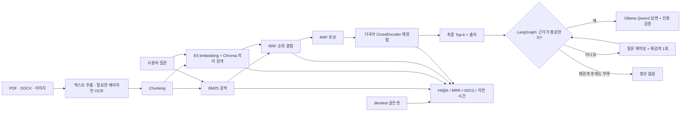

# gongo-rag

한국어 정부 지원사업 공고문을 검색하고, **근거를 인용해 답하며 근거가 부족하면 거절하는 RAG**를 만드는 프로젝트입니다.

처음 읽는다면 [RAG 전체 작업 지도](docs/RAG_WORKFLOW.md)에서 완료한 일, 남은 일과
파일 입력부터 최종 답변·평가·배포까지의 순서를 먼저 확인하세요.

이 저장소의 목적은 단순 데모가 아니라 다음 세 가지를 증명하는 것입니다.

1. 검색과 답변 품질을 분리해 측정할 수 있다.
2. 한국어 문서 검색의 실패를 숫자와 사례로 설명할 수 있다.
3. 직접 구현한 기준선에서 현업형 RAG 구조로 발전시킬 수 있다.

## 현재 상태

> **v0 기준선 구현 완료, 현업형 구조로 전환 중**

| 영역 | 현재 구현 | 다음 단계 |
|---|---|---|
| 문서 처리 | PDF·DOCX·이미지 추출, 문단 우선 chunking, LangChain Document 변환 | 색인 수명 관리 |
| 검색 | Kiwi BM25 + E5/Chroma + chunk ID 기반 RRF 통합 검색 | 검색 실패 유형 확장 |
| 재정렬 | 로컬 BGE + 후보 7개 최종 설정 | 답변 평가와 운영 최적화 |
| 답변 | 로컬 Qwen3 + LangGraph 근거 판단·재검색 1회·인용 답변·안전한 거절 | Ragas + 사람 검토 |
| 평가 | dev로 설정 선택·test 1회 완료, Hit@k·MRR·nDCG·지연 리포트 | Ragas + 사람 답변 평가 |
| 서비스 | 업로드부터 답변까지 한 번 실행, BM25·Embedding·RRF·BGE Top-k 추적 | Docker와 재현 가능한 실행 환경 |

최초 후보 10개 기준 reranker는 dev normal 20문항에서 Hit@1 0.80, MRR 0.90,
CPU 평균 약 6.28초였습니다. 후보 7개는 Hit@1 0.85, MRR 0.925를 기록하면서
평균 지연을 약 4.20초로 33.1% 줄였습니다.

같은 후보 7개로 568M BGE와 118M MiniLM을 다시 비교하자 MiniLM은 약 9.8배
빨랐지만 Hit@1이 0.85에서 0.70으로 떨어졌습니다. 따라서 품질 우선 기본값은
BGE로 유지하고 MiniLM은 속도 우선 선택지로만 기록했습니다.

리랭커는 로컬 BGE, 답변 모델은 Ollama의 로컬 Qwen3 4B로 고정했습니다. 따라서
문서와 질문은 검색·재정렬·답변 단계에서 외부 API로 전송되지 않습니다.

잠가 둔 test normal 10문항을 한 번 실행한 결과 BGE reranker는 Hit@1 0.80,
Hit@3·5 0.90, MRR 0.85였습니다. `q026`은 자동 평가에서 실패했지만 BM25 검색
1위에 같은 제출 마감일이 있어 사람이 보면 답할 수 있는 false negative였습니다.
수치는 사후 수정하지 않고 그대로 보존합니다.

잠근 검색기는 LangGraph workflow에 연결했습니다. 근거가 충분하면 `[근거 N]`으로
답하고, 부족하면 질문을 한 번 고쳐 재검색하며, 그래도 부족하면 `정보 없음`으로
끝납니다. 존재하지 않는 근거 번호나 근거에 없는 숫자가 나오면 답변을 노출하지
않고 안전하게 거절합니다. 성공·재검색·거절 경로는 외부 API 없는 단위 테스트로
검증했고, 실제 LLM 답변 품질 측정은 다음 Ragas·사람 평가 단계에서 진행합니다.

## 현재 아키텍처



목표 구조는 `LangChain → BM25/Chroma → RRF → reranker → LangGraph → Ragas`입니다. 각 도구를 추가하기 전에 현재 기준선을 보존하고, 같은 평가셋으로 개선 여부를 확인합니다.

## 실행

Windows PowerShell 기준입니다.

### Python RAG 준비하기

```powershell
python -m venv .venv
.venv\Scripts\Activate.ps1
pip install -r requirements.txt

python tests\test_chunker.py
python tests\test_bm25.py
python tests\test_bm25_retriever.py
python tests\test_vector_search.py
python tests\test_hybrid_search.py
python tests\test_reranker.py
python tests\test_evaluate.py
python tests\test_retrieval_evaluation.py
python tests\test_rag_answer.py
python tests\test_local_llm.py
python tests\test_rag_workflow.py
python tests\test_document_ingestion.py
python tests\test_document_chunking.py
python tests\test_document_upload_ui.py
```

검색부터 답변까지 API 키가 필요하지 않습니다.

### 로컬 답변 모델 준비하기

[Ollama](https://ollama.com/download)를 설치하고 한국어를 포함한 다국어 모델을
한 번 내려받습니다. 기본 모델은 약 2.5GB인 `qwen3:4b`입니다.

```powershell
ollama pull qwen3:4b
```

Windows용 Ollama는 보통 설치 후 백그라운드에서 실행됩니다. 앱에
`Ollama에 연결할 수 없습니다`가 표시될 때만 Ollama 앱을 열거나 다음 명령을
실행합니다.

```powershell
ollama serve
```

다른 로컬 모델이나 주소를 사용할 때만 `.env.example`을 `.env`로 복사해
`OLLAMA_MODEL`, `OLLAMA_BASE_URL`을 바꿉니다. 비밀 API 키는 없습니다.
Qwen3의 생각 과정은 끄고 Ollama의 구조화된 JSON 출력으로 근거 판단·질문 재작성·
답변 형식을 고정합니다. 형식이 잘못된 재작성은 원래 질문으로 되돌려 검색을 보호하며,
최종 답변은 코드가 인용 번호와 근거 속 숫자를 한 번 더 검사합니다.

### 파일을 올려 글자로 바꾸기

```powershell
streamlit run app.py
```

하나의 Streamlit 앱 안에서 모든 기능을 사용합니다.

- `RAG 실행`: 문서를 선택하고 질문한 뒤 버튼 한 번으로 추출 → Chunk → 색인 →
  BM25·Embedding → RRF → 로컬 BGE → LangGraph 답변을 실행합니다.
- `평가`: dev/test 성능, BGE 선택 근거와 자동 평가의 실패 사례를 공개합니다.
- `세부 실험`: 각 단계를 따로 실행하며 설정과 원점수를 공부할 때 사용합니다.

`RAG 실행` 결과에는 답변과 네 검색 단계의 Top-k가 동시에 나타납니다. 같은
Chunk는 모든 단계에서 같은 색으로 표시되고, BGE가 RRF 순위를 얼마나 올리거나
내렸는지와 답변에 실제로 인용됐는지를 바로 확인할 수 있습니다. 원점수와 인용
원문은 아래 펼침 영역에 두어 첫 화면은 검색 흐름에 집중합니다. 화면의 데이터는
별도 목업이 아니라 같은 Python RAG 실행에서 기록한 실제 결과입니다.

브라우저의 `세부 실험` 탭에서 일반 PDF, 스캔 PDF, DOCX, 이미지를
올릴 수 있습니다. 일반 PDF와 DOCX는 바로 읽고, 스캔 PDF와 이미지는
Tesseract OCR로 한국어와 영어를 읽습니다. OCR 엔진 설치와 파일별 제한은
[1번 작업: 파일 속 글자 꺼내기](docs/INGESTION.md)에 쉬운 설명과 면접 대비
기술 내용을 함께 정리했습니다.

추출 결과를 미리 보고 TXT로 받을 수 있습니다. 이어서 같은 화면에서 문단
우선 또는 고정 길이 방식으로 chunk를 만들고 metadata를 확인할 수 있습니다.
자세한 학습 내용은
[2번 작업: 긴 글을 검색용 조각으로 나누기](docs/CHUNKING.md)에 정리했습니다.
만든 chunk는 Kiwi 형태소 분석을 사용하는 BM25로 바로 검색할 수 있습니다.
검색 원리, 한국어 조사 처리와 면접 대비 내용은
[3번 작업: 질문과 같은 단어가 있는 조각 찾기](docs/BM25.md)에 정리했습니다.
같은 chunk를 한국어 지원 E5 모델로 embedding하고 로컬 Chroma에 저장해
의미로 검색할 수도 있습니다. 자세한 내용은
[4번 작업: 같은 뜻의 문서 조각 찾기](docs/VECTOR_SEARCH.md)에 정리했습니다.
두 검색 결과는 공통 chunk ID와 순위를 사용해 RRF로 합칩니다. 원점수를
직접 더하지 않는 이유와 실제 성공·실패 사례는
[5번 작업: 두 검색기의 순위를 합치기](docs/RRF.md)에 정리했습니다.
RRF 상위 후보는 한국어를 포함한 다국어 CrossEncoder가 질문과 본문을 함께
읽고 다시 정렬합니다. 실제 한국어 PDF의 개선·실패 사례와 면접 대비 내용은
[6번 작업: 질문과 후보를 함께 읽어 다시 정렬하기](docs/RERANKER.md)에
정리했습니다.
실제 공고문 3개에서 만든 고정 질문으로 네 검색기를 같은 조건에서 비교하는 방법과
dev 결과는 [7번 작업: 같은 시험지로 검색기 성적 비교하기](docs/EVALUATION.md)에
정리했습니다. 사람이 읽는 실제 결과는
[dev 검색 평가 리포트](experiments/retrieval-evaluation-dev.md)에서 바로 볼 수
있습니다.
후보 10·7·5개의 속도와 정확도를 비교해 7개를 선택한 근거는
[reranker 후보 수 비교](experiments/reranker-candidate-comparison-dev.md)에
남겼습니다.
같은 후보 7개에서 BGE와 작은 MiniLM의 품질·속도·메모리를 비교한 결과와
모델 선택 근거는
[작은 로컬 reranker 비교](experiments/reranker-model-comparison-dev.md)에
남겼습니다.
최종 test 결과와 `q026` 수동 검토는
[test 검색 평가 리포트](experiments/retrieval-evaluation-test.md)에 남겼습니다.

```powershell
python src\run_retrieval_evaluation.py --split dev
```

재정렬은 로컬 BGE, LangGraph 판단·재작성·답변은 로컬 Ollama를 사용하므로
외부 서비스 API 키가 필요하지 않습니다.

```powershell
python src\run_rag_workflow.py "신청 마감은 언제인가요?"
streamlit run app.py
```

CLI는 실행한 노드, 재작성 질문, 최종 답변, 파일명·페이지·chunk ID를 보여줍니다.
Ollama를 아직 설치하지 않아도 `python -m pytest tests\test_local_llm.py
tests\test_rag_workflow.py -q`로 로컬 API 연결과 성공·재검색·거절 경로를 확인할
수 있습니다.

## 평가 원칙

- 골든셋은 실험 도중 정답을 맞추기 위해 수정하지 않습니다.
- 설정은 dev로 골랐고 test는 한 번 실행했습니다. 이제 test에 맞춰 다시 튜닝하지 않습니다.
- chunk 크기, tokenizer, 검색기처럼 **한 번에 하나의 변수만** 바꿉니다.
- Hit@1·3·5·10, MRR, nDCG와 지연 시간을 함께 봅니다.
- 검색 실패, 답변 실패, 원문 데이터 문제를 따로 기록합니다.
- Ragas 점수만 믿지 않고 한국어 질문·근거·답변을 사람이 함께 확인합니다.

## 저장소 구조

```text
gongo-rag/
├── app.py                 # 업로드부터 네 단계 Top-k·근거 답변까지 합친 Streamlit 앱
├── .chroma/               # 로컬 vector DB (git 제외)
├── data/                  # 골든셋
├── docs/raw/              # 원본 공고문 PDF
├── docs/text/             # 추출 텍스트
├── experiments/           # 비교 실험과 결정 기록
├── notes/                 # 관찰 기록
├── src/                   # 추출·검색·reranker·Ollama·LangGraph·Trace UI·평가
└── tests/                 # 핵심 로직 자가 검증
```

전체 학습 순서와 “무엇을 왜 만드는지”는
[RAG 전체 작업 지도](docs/RAG_WORKFLOW.md)에 한 문서로 정리합니다.

## 다음 마일스톤

1. Ragas·수동 검토를 포함한 답변 평가표 작성하기
2. Docker와 재현 가능한 실행 환경 제공하기
