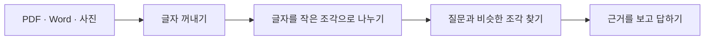

# 1번 작업: 파일 속 글자 꺼내기

## 한 줄로 설명하면

PDF, Word, 사진을 올리면 **컴퓨터가 검색할 수 있는 글자**로 바꾸는
기능입니다.

RAG는 책을 보고 답하는 AI입니다. 그런데 AI에게 책을 사진째 던져주면 어디에
무슨 말이 있는지 찾기 어렵습니다. 그래서 가장 먼저 파일 속 글자를 꺼내야
합니다.

이 문서에서 기억할 것은 세 가지입니다.

1. RAG가 답하려면 먼저 파일을 글자로 바꿔야 합니다.
2. 일반 PDF는 바로 읽고, 사진 같은 문서는 OCR로 읽습니다.
3. 지금은 글자를 꺼내는 데까지 끝났고, 검색 창고에 넣는 일은 다음 작업입니다.

## 왜 가장 먼저 만들었나요?

친구에게 문제집 사진을 주고 “지원 금액이 얼마야?”라고 물었다고 생각해봅시다.
친구가 사진 속 글자를 읽지 못하면 정답을 찾을 수 없습니다.

RAG도 똑같습니다.



파일은 사용자가 준비하는 재료입니다. 이번에 끝낸 첫 번째 실제 작업은
**‘글자 꺼내기’**입니다.

## 어떤 파일을 읽을 수 있나요?

| 올리는 파일 | 프로그램이 하는 일 |
|---|---|
| 일반 PDF | PDF 안에 이미 들어 있는 글자를 바로 꺼냅니다. |
| 스캔 PDF | 사진처럼 된 페이지만 OCR로 읽습니다. |
| Word `.docx` | 문단과 표에 적힌 글자를 순서대로 꺼냅니다. |
| PNG, JPG, TIFF, BMP | 사진 속 글자를 OCR로 읽습니다. |
| TXT, MD | 저장된 글자를 그대로 읽습니다. |

옛날 Word 파일인 `.doc`는 아직 읽지 않습니다. Word에서 `.docx`로 다시
저장하면 됩니다.

## 일반 PDF와 스캔 PDF는 무엇이 다른가요?

겉보기에는 둘 다 PDF지만 안쪽은 다를 수 있습니다.

- 마우스로 글자를 선택하고 복사할 수 있으면 **일반 PDF**입니다.
- 한 장의 사진처럼 글자를 선택할 수 없으면 **스캔 PDF**입니다.

일반 PDF는 글자를 바로 꺼내므로 빠르고 비교적 정확합니다. 스캔 PDF는 사진을
눈으로 읽는 것처럼 OCR이 필요합니다.

OCR은 **사진 속 글자를 컴퓨터 글자로 바꾸는 기술**입니다. 이 프로젝트는
한국어와 영어를 함께 읽도록 `kor+eng`를 사용합니다.

## 프로그램은 어떤 순서로 움직이나요?

1. 사용자가 파일을 올립니다.
2. 파일 이름과 크기, 파일 종류를 확인합니다.
3. 일반 PDF라면 저장된 글자를 먼저 꺼냅니다.
4. 글자가 거의 없는 PDF 페이지만 OCR로 다시 읽습니다.
5. Word라면 문단과 표를 순서대로 읽습니다.
6. 결과를 페이지별로 합칩니다.
7. 화면에 글자 수, 읽은 방법, 경고와 결과를 보여줍니다.

일반 PDF까지 전부 OCR하지 않는 이유는 OCR이 훨씬 느리기 때문입니다.
필요한 페이지만 OCR하면 더 빠르고 원래 글자도 그대로 지킬 수 있습니다.

## 화면에서는 어떻게 사용하나요?

앱을 실행하고 다음 순서대로 누르면 됩니다.

1. `1. 문서 넣기` 탭을 엽니다.
2. PDF, Word 또는 이미지 파일을 올립니다.
3. `텍스트 추출` 버튼을 누릅니다.
4. `추출 결과 미리보기`를 읽어봅니다.
5. 전체 결과가 필요하면 `추출 텍스트 받기`를 누릅니다.

여러 파일을 한 번에 올려도 파일별로 결과를 보여줍니다.

## 화면에 나오는 말은 무슨 뜻인가요?

| 화면의 말 | 쉬운 뜻 |
|---|---|
| 글자 수 | 꺼낸 글자가 모두 몇 개인지 보여줍니다. |
| 구역 수 | PDF 페이지처럼 나누어 읽은 구역의 수입니다. |
| OCR 사용 | 사진 속 글자를 읽었는지 알려줍니다. |
| 경고 | 읽지 못한 부분이나 준비가 필요한 기능을 알려줍니다. |
| `native` | PDF 안에 있던 글자를 바로 꺼냈습니다. |
| `ocr` | 사진을 보고 글자를 읽었습니다. |
| `docx` | Word의 문단과 표를 읽었습니다. |
| `plain` | TXT나 MD의 글자를 그대로 읽었습니다. |
| `empty` | 꺼낸 글자가 없습니다. |

## 실제 결과 예시

사진에 다음 글자가 있다고 가정합니다.

```text
신청 자격
창업 3년 이내 기업
지원 금액 1억원
```

한국어 OCR을 실제로 실행했을 때 위 세 줄이 그대로 추출되는 것을
확인했습니다.

결과에는 글자만 있는 것이 아니라 다음 정보도 함께 남습니다.

- 원래 파일 이름
- 페이지 번호
- 글자를 읽은 방법
- 파일이 같은지 확인하는 값
- 읽는 동안 생긴 경고

이 정보는 나중에 “이 답변은 어느 파일 몇 페이지에서 찾았나요?”라고
알려줄 때 사용합니다.

## 잘 만들었는지 어떻게 확인했나요?

- 일반 PDF는 OCR 없이 글자를 꺼냈습니다.
- 스캔 PDF는 OCR 단계로 넘어갔습니다.
- 한국어 이미지 OCR이 실제로 동작했습니다.
- Word의 문단과 표를 읽었습니다.
- 한글 TXT 파일을 읽었습니다.
- 손상된 이미지와 암호 PDF를 안전하게 거절했습니다.
- OCR이 없어도 앱이 꺼지지 않고 해결 방법을 보여줬습니다.
- 문서 추출 테스트 10개와 화면 테스트 2개가 통과했습니다.
- 기존 검색 관련 테스트 17개도 그대로 통과했습니다.

## 사람이 꼭 확인해야 하는 것

OCR은 사람처럼 가끔 틀릴 수 있습니다. 파일을 올린 뒤 다음 다섯 가지만
눈으로 확인하면 됩니다.

1. 제목과 중요한 문장이 빠지지 않았나요?
2. 페이지 순서가 맞나요?
3. 날짜와 금액을 정확히 읽었나요?
4. 표의 행과 열이 너무 이상하게 섞이지 않았나요?
5. 화면에 경고가 나오지 않았나요?

특히 `1억원`, `2026년 7월 31일`, 전화번호 같은 숫자는 꼭 확인해야 합니다.

## 지금 할 수 없는 것

- Word 안에 들어 있는 그림의 글자는 아직 읽지 않습니다.
- 손글씨나 흐릿한 사진은 잘못 읽을 수 있습니다.
- 복잡한 표는 칸 모양이 사라질 수 있습니다.
- 암호로 잠긴 PDF는 암호를 풀어야 합니다.
- 파일 하나는 최대 20MB까지 받습니다.
- 올린 문서를 아직 검색 창고인 ChromaDB에 자동 저장하지 않습니다.

## 1번 작업의 완료 상태

- [x] PDF에서 글자 꺼내기
- [x] 스캔 PDF에서 필요한 페이지만 OCR하기
- [x] Word 문단과 표 읽기
- [x] 이미지에서 한국어와 영어 읽기
- [x] 여러 파일을 올릴 수 있는 화면 만들기
- [x] 결과 미리보기와 TXT 받기
- [x] 오류와 경고를 사람이 이해할 수 있게 보여주기
- [ ] 추출한 글자를 작은 조각으로 나누기
- [ ] ChromaDB에 저장하기
- [ ] 올린 문서에 바로 질문하기

마지막 세 가지는 **2번 작업**에서 진행합니다.

## 다음에는 무엇을 하나요?

다음 순서는 아래와 같습니다.

```text
추출한 글자
→ 질문에 답하기 좋은 크기로 나누기
→ 파일명과 페이지 번호 붙이기
→ ChromaDB에 저장하기
→ 질문과 비슷한 조각 찾아보기
```

리랭커는 아직 추가하지 않습니다. 먼저 문서를 잘 저장하고 관련 있는 조각을
찾을 수 있어야 리랭커를 붙였을 때 정말 좋아졌는지 비교할 수 있습니다.

---

## 개발자용 실행 부록

처음 한 번 설치하고 앱을 실행합니다.

```powershell
python -m venv .venv
.venv\Scripts\Activate.ps1
pip install -r requirements.txt
streamlit run app.py
```

UI 없이 파일 하나만 추출할 수도 있습니다.

```powershell
python src\document_ingestion.py "C:\문서\공고문.pdf"
python src\document_ingestion.py "C:\문서\공고문.docx" -o "result.txt"
```

`docs/raw`의 PDF를 한꺼번에 `docs/text`로 옮기는 명령입니다.

```powershell
python src\extract_pdf.py
```

스캔 PDF와 이미지에는 Tesseract 5 실행 파일과 `kor`, `eng` 언어 데이터가
필요합니다.

```powershell
$env:TESSERACT_CMD = "C:\Program Files\Tesseract-OCR\tesseract.exe"
tesseract --list-langs
```

언어 파일을 사용자 폴더에 따로 설치했을 때만 아래 설정도 사용합니다.

```powershell
$env:TESSDATA_PREFIX = "$env:LOCALAPPDATA\Tesseract-OCR\tessdata"
```

목록에 `kor`와 `eng`가 보이면 준비가 끝난 것입니다. 일반 PDF와 Word는
Tesseract가 없어도 읽을 수 있습니다.

코드에서는 화면과 상관없이 공통 추출 함수를 재사용할 수 있습니다.

```python
from src.document_ingestion import extract_document

result = extract_document("notice.pdf", uploaded_bytes)

print(result.text)
print(result.pages[0].method)
print(result.source_sha256)
print(result.warnings)
```
