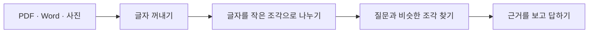
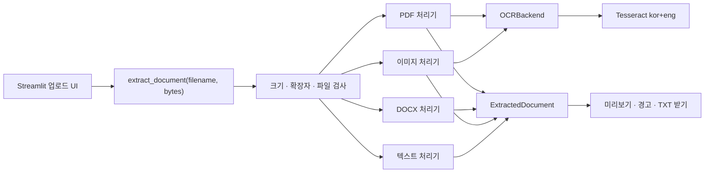

# 1번 작업: 파일 속 글자 꺼내기

## 이 문서 읽는 방법

- 처음 공부한다면 `한 줄로 설명하면`부터 `다음에는 무엇을 하나요?`까지
  읽습니다.
- 면접을 준비한다면 `면접 대비: 기술적으로 어떻게 만들었나요?`부터 읽습니다.
- 직접 실행할 때는 맨 아래 `개발자용 실행 부록`만 보면 됩니다.

## 한 줄로 설명하면

PDF, Word, 사진을 올리면 **컴퓨터가 검색할 수 있는 글자**로 바꾸는
기능입니다.

RAG는 책을 보고 답하는 AI입니다. 그런데 AI에게 책을 사진째 던져주면 어디에
무슨 말이 있는지 찾기 어렵습니다. 그래서 가장 먼저 파일 속 글자를 꺼내야
합니다.

이 문서에서 기억할 것은 세 가지입니다.

1. RAG가 답하려면 먼저 파일을 글자로 바꿔야 합니다.
2. 일반 PDF는 바로 읽고, 사진 같은 문서는 OCR로 읽습니다.
3. 지금은 글자를 꺼내는 데까지 끝났고, 검색 창고에 넣는 일은 다음 작업입니다.

## 왜 가장 먼저 만들었나요?

친구에게 문제집 사진을 주고 “지원 금액이 얼마야?”라고 물었다고 생각해봅시다.
친구가 사진 속 글자를 읽지 못하면 정답을 찾을 수 없습니다.

RAG도 똑같습니다.



파일은 사용자가 준비하는 재료입니다. 이번에 끝낸 첫 번째 실제 작업은
**‘글자 꺼내기’**입니다.

## 어떤 파일을 읽을 수 있나요?

| 올리는 파일 | 프로그램이 하는 일 |
|---|---|
| 일반 PDF | PDF 안에 이미 들어 있는 글자를 바로 꺼냅니다. |
| 스캔 PDF | 사진처럼 된 페이지만 OCR로 읽습니다. |
| Word `.docx` | 문단과 표에 적힌 글자를 순서대로 꺼냅니다. |
| PNG, JPG, TIFF, BMP | 사진 속 글자를 OCR로 읽습니다. |
| TXT, MD | 저장된 글자를 그대로 읽습니다. |

옛날 Word 파일인 `.doc`는 아직 읽지 않습니다. Word에서 `.docx`로 다시
저장하면 됩니다.

## 일반 PDF와 스캔 PDF는 무엇이 다른가요?

겉보기에는 둘 다 PDF지만 안쪽은 다를 수 있습니다.

- 마우스로 글자를 선택하고 복사할 수 있으면 **일반 PDF**입니다.
- 한 장의 사진처럼 글자를 선택할 수 없으면 **스캔 PDF**입니다.

일반 PDF는 글자를 바로 꺼내므로 빠르고 비교적 정확합니다. 스캔 PDF는 사진을
눈으로 읽는 것처럼 OCR이 필요합니다.

OCR은 **사진 속 글자를 컴퓨터 글자로 바꾸는 기술**입니다. 이 프로젝트는
한국어와 영어를 함께 읽도록 `kor+eng`를 사용합니다.

## 프로그램은 어떤 순서로 움직이나요?

1. 사용자가 파일을 올립니다.
2. 파일 이름과 크기, 파일 종류를 확인합니다.
3. 일반 PDF라면 저장된 글자를 먼저 꺼냅니다.
4. 글자가 거의 없는 PDF 페이지만 OCR로 다시 읽습니다.
5. Word라면 문단과 표를 순서대로 읽습니다.
6. 결과를 페이지별로 합칩니다.
7. 화면에 글자 수, 읽은 방법, 경고와 결과를 보여줍니다.

일반 PDF까지 전부 OCR하지 않는 이유는 OCR이 훨씬 느리기 때문입니다.
필요한 페이지만 OCR하면 더 빠르고 원래 글자도 그대로 지킬 수 있습니다.

## 화면에서는 어떻게 사용하나요?

앱을 실행하고 다음 순서대로 누르면 됩니다.

1. `문서 실험실` 탭을 엽니다.
2. PDF, Word 또는 이미지 파일을 올립니다.
3. `텍스트 추출` 버튼을 누릅니다.
4. `추출 결과 미리보기`를 읽어봅니다.
5. 전체 결과가 필요하면 `추출 텍스트 받기`를 누릅니다.

여러 파일을 한 번에 올려도 파일별로 결과를 보여줍니다.

## 화면에 나오는 말은 무슨 뜻인가요?

| 화면의 말 | 쉬운 뜻 |
|---|---|
| 글자 수 | 꺼낸 글자가 모두 몇 개인지 보여줍니다. |
| 구역 수 | PDF 페이지처럼 나누어 읽은 구역의 수입니다. |
| OCR 사용 | 사진 속 글자를 읽었는지 알려줍니다. |
| 경고 | 읽지 못한 부분이나 준비가 필요한 기능을 알려줍니다. |
| `native` | PDF 안에 있던 글자를 바로 꺼냈습니다. |
| `ocr` | 사진을 보고 글자를 읽었습니다. |
| `docx` | Word의 문단과 표를 읽었습니다. |
| `plain` | TXT나 MD의 글자를 그대로 읽었습니다. |
| `empty` | 꺼낸 글자가 없습니다. |

## 실제 결과 예시

사진에 다음 글자가 있다고 가정합니다.

```text
신청 자격
창업 3년 이내 기업
지원 금액 1억원
```

한국어 OCR을 실제로 실행했을 때 위 세 줄이 그대로 추출되는 것을
확인했습니다.

결과에는 글자만 있는 것이 아니라 다음 정보도 함께 남습니다.

- 원래 파일 이름
- 페이지 번호
- 글자를 읽은 방법
- 파일이 같은지 확인하는 값
- 읽는 동안 생긴 경고

이 정보는 나중에 “이 답변은 어느 파일 몇 페이지에서 찾았나요?”라고
알려줄 때 사용합니다.

## 잘 만들었는지 어떻게 확인했나요?

- 일반 PDF는 OCR 없이 글자를 꺼냈습니다.
- 스캔 PDF는 OCR 단계로 넘어갔습니다.
- 한국어 이미지 OCR이 실제로 동작했습니다.
- Word의 문단과 표를 읽었습니다.
- 한글 TXT 파일을 읽었습니다.
- 손상된 이미지와 암호 PDF를 안전하게 거절했습니다.
- OCR이 없어도 앱이 꺼지지 않고 해결 방법을 보여줬습니다.
- 문서 추출 테스트 10개와 화면 테스트 2개가 통과했습니다.
- 기존 검색 관련 테스트 17개도 그대로 통과했습니다.

## 사람이 꼭 확인해야 하는 것

OCR은 사람처럼 가끔 틀릴 수 있습니다. 파일을 올린 뒤 다음 다섯 가지만
눈으로 확인하면 됩니다.

1. 제목과 중요한 문장이 빠지지 않았나요?
2. 페이지 순서가 맞나요?
3. 날짜와 금액을 정확히 읽었나요?
4. 표의 행과 열이 너무 이상하게 섞이지 않았나요?
5. 화면에 경고가 나오지 않았나요?

특히 `1억원`, `2026년 7월 31일`, 전화번호 같은 숫자는 꼭 확인해야 합니다.

## 지금 할 수 없는 것

- Word 안에 들어 있는 그림의 글자는 아직 읽지 않습니다.
- 손글씨나 흐릿한 사진은 잘못 읽을 수 있습니다.
- 복잡한 표는 칸 모양이 사라질 수 있습니다.
- 암호로 잠긴 PDF는 암호를 풀어야 합니다.
- 파일 하나는 최대 20MB까지 받습니다.
- 추출 결과는 chunking 후 로컬 ChromaDB에 저장·검색할 수 있습니다.

## 1번 작업의 완료 상태

- [x] PDF에서 글자 꺼내기
- [x] 스캔 PDF에서 필요한 페이지만 OCR하기
- [x] Word 문단과 표 읽기
- [x] 이미지에서 한국어와 영어 읽기
- [x] 여러 파일을 올릴 수 있는 화면 만들기
- [x] 결과 미리보기와 TXT 받기
- [x] 오류와 경고를 사람이 이해할 수 있게 보여주기
- [x] 추출한 글자를 작은 조각으로 나누기
- [x] ChromaDB에 저장하기
- [ ] 올린 문서에 바로 질문하기

문서 분할과 Chroma 저장은 이후 단계에서 완료했습니다. 업로드한 문서의
검색 결과를 LLM 답변에 바로 연결하는 작업은 RRF와 reranker 뒤에 진행합니다.

## 다음에는 무엇을 하나요?

현재까지 연결된 순서는 아래와 같습니다.

```text
추출한 글자
→ 질문에 답하기 좋은 크기로 나누기
→ 파일명과 페이지 번호 붙이기
→ ChromaDB에 저장하기
→ 질문과 비슷한 조각 찾아보기
```

자세한 내용은 [2번 chunking](CHUNKING.md), [3번 BM25](BM25.md),
[4번 Chroma 의미 검색](VECTOR_SEARCH.md) 문서에서 이어집니다.
리랭커는 아직 추가하지 않았습니다.

---

## 면접 대비: 기술적으로 어떻게 만들었나요?

여기부터는 면접에서 구현 이유를 설명하기 위한 기술 내용입니다. 앞부분을
이해한 뒤 읽으면 됩니다.

### 30초 설명

> 여러 문서 형식을 하나의 결과 모델로 바꾸는 문서 입력 계층을 구현했습니다.
> 일반 PDF는 PyMuPDF로 저장된 텍스트를 우선 추출하고, 페이지의 유효 글자가
> 30자보다 적을 때만 Tesseract `kor+eng` OCR을 실행합니다. DOCX는 문단과
> 표의 문서 순서를 보존해 읽습니다. 추출 코어와 Streamlit UI를 분리했고,
> OCR 인터페이스를 주입할 수 있게 만들어 외부 프로그램 없이도 주요 분기를
> 자동 테스트했습니다.

### 전체 구조



핵심 코드는 두 부분으로 나눴습니다.

| 파일 | 책임 |
|---|---|
| [`src/document_ingestion.py`](../src/document_ingestion.py) | 파일 검사, 형식별 추출, OCR, 결과 모델 |
| [`src/document_upload_ui.py`](../src/document_upload_ui.py) | 업로드, 설정, 미리보기, 오류 표시, 다운로드 |

이렇게 분리했기 때문에 추출 코어는 Streamlit을 몰라도 됩니다. 나중에
FastAPI, 배치 작업, LangChain에서도 같은 `extract_document()`를 다시
사용할 수 있습니다.

### 왜 공통 결과 모델을 만들었나요?

PDF, Word, 이미지는 읽는 방법이 서로 다릅니다. 하지만 다음 단계인 chunking은
파일 종류마다 다른 코드를 알고 싶어 하지 않습니다. 그래서 모든 결과를
`ExtractedDocument` 하나로 통일했습니다.

```text
ExtractedDocument
├── filename          원본 파일 이름
├── file_type         pdf, docx, image, text
├── source_sha256     파일 내용으로 만든 고유 해시
├── pages[]           페이지 또는 문서 구역
│   ├── page_number
│   ├── label
│   ├── text
│   └── method        native, ocr, docx, plain, empty
└── warnings[]        사용자에게 보여줄 경고
```

`source_sha256`는 파일 이름이 달라도 내용이 같은 문서를 찾는 데 사용할 수
있습니다. 아직 중복 제거까지 연결하지는 않았지만 다음 색인 단계에서 사용할
수 있도록 미리 남겼습니다.

`method`를 페이지별로 저장한 이유는 한 PDF 안에도 일반 텍스트 페이지와
스캔 페이지가 섞일 수 있기 때문입니다. 나중에 OCR로 읽은 페이지만 따로
검수하거나 품질을 비교할 수 있습니다.

### PDF 처리 방식

PDF는 페이지마다 아래 순서로 처리합니다.

```text
PyMuPDF로 저장된 글자 추출
→ 공백을 뺀 글자가 30자 이상인가?
   ├─ 예: native 결과 사용
   └─ 아니요: 페이지를 250 DPI PNG로 변환
              → Tesseract kor+eng OCR
              → 더 많은 글자를 얻은 결과 사용
```

중요한 설계 결정은 **PDF 전체가 아니라 페이지별로 OCR 여부를 판단한다**는
점입니다.

- 일반 페이지는 빠르고 정확한 원본 텍스트를 지킵니다.
- 스캔 페이지만 OCR 비용을 사용합니다.
- OCR 결과가 원래 텍스트보다 짧으면 원래 텍스트를 유지합니다.
- OCR이 없어도 원래 텍스트가 있으면 계속 처리합니다.

현재 `30자` 기준은 간단한 휴리스틱입니다. 절대적인 정답은 아닙니다.
운영 환경에서는 이미지가 차지하는 비율, 깨진 문자 비율, 문서 유형별
통계를 함께 사용해 개선할 수 있습니다.

### 한국어 OCR 설정

OCR은 Tesseract를 `kor+eng` 언어 조합으로 실행합니다.

| 설정 | 기본값 | 이유 |
|---|---:|---|
| OCR 언어 | `kor+eng` | 한국어 공고문의 한글·영문 약어·숫자를 함께 읽기 위해 |
| 렌더링 해상도 | 250 DPI | 정확도와 처리 속도 사이의 시작점 |
| 페이지 분석 | PSM 4 | 여러 줄로 구성된 한글 문서를 위에서 아래로 읽기 위해 |
| OCR 엔진 | OEM 1 | Tesseract LSTM 엔진 사용 |
| 페이지 제한 시간 | 45초 | 비정상적으로 오래 걸리는 문서가 작업을 막지 않도록 |

Tesseract 실행 파일은 다음 순서로 찾습니다.

1. `TESSERACT_CMD` 환경 변수
2. 운영체제의 PATH
3. Windows 기본 설치 경로

실행 파일뿐 아니라 `kor`, `eng` 언어 데이터가 실제로 있는지도 확인합니다.
준비 상태는 한 번 확인한 뒤 같은 추출 작업 안에서 캐시하여 페이지마다
버전 확인 명령을 반복하지 않습니다.

### DOCX 처리 방식

`python-docx`로 문단과 표를 읽습니다. 단순히 모든 문단을 읽은 다음 표를
붙이면 원래 순서가 달라질 수 있으므로, DOCX 본문의 XML 요소를 순회하면서
문단(`CT_P`)과 표(`CT_Tbl`)를 만나는 순서대로 처리합니다.

표의 각 행은 다음처럼 단순한 텍스트로 바꿉니다.

```text
[표]
항목 | 내용
지원 금액 | 최대 1억원
```

이 방식은 검색용 텍스트를 빠르게 만드는 데 유리하지만, 셀 병합과 복잡한
레이아웃 정보는 잃습니다. DOCX 안에 그림이 있으면 현재는 OCR하지 않고
경고를 남깁니다.

### TXT와 한글 인코딩 처리

텍스트 파일은 아래 순서로 디코딩합니다.

1. `UTF-8-SIG`
2. `CP949`
3. `EUC-KR`

과거 Windows에서 만든 한글 문서도 읽기 위한 순서입니다. 추출 후에는
유니코드를 NFC 형태로 정규화하고, 줄바꿈과 빈 줄을 정리합니다.

### 안전장치와 오류 처리

사용자가 잘못된 파일을 올려도 앱 전체가 종료되지 않도록 도메인 오류를
분리했습니다.

| 오류 | 처리 |
|---|---|
| 지원하지 않는 확장자 | 지원 형식을 안내 |
| 옛날 `.doc` | `.docx`로 다시 저장하도록 안내 |
| 20MB 초과 | 추출 전에 거절 |
| PDF 확장자지만 PDF가 아님 | `%PDF` 헤더 검사 후 거절 |
| DOCX 확장자지만 DOCX가 아님 | ZIP 헤더와 실제 DOCX 열기 검사 |
| 손상된 이미지 | Pillow `verify()`로 검사 후 거절 |
| 암호 PDF | 암호를 해제한 파일을 요청 |
| OCR 프로그램·언어 없음 | 일반 문서는 계속 처리하고 경고 표시 |

파일 이름에는 디렉터리 경로를 제거한 이름만 사용합니다. 다만 현재 구현은
포트폴리오 데모 수준입니다. 운영 서비스라면 악성코드 검사, ZIP 폭탄 방어,
최대 페이지 수·이미지 크기 제한, 사용자별 저장 공간 제한도 추가해야 합니다.

### UI를 별도 컴포넌트로 만든 이유

`render_document_upload()` 하나를 호출하면 업로드 화면을 다른 Streamlit
앱에도 넣을 수 있습니다.

- 여러 파일 업로드
- OCR 사용 여부와 DPI 설정
- OCR 준비 상태 표시
- 파일별 결과와 경고 표시
- 앞 8,000자 미리보기
- UTF-8 TXT 다운로드

추출 결과는 Streamlit `session_state`에 보관합니다. 따라서 화면이 다시
그려져도 바로 사라지지는 않지만, 서버를 재시작하면 없어집니다. 아직 영구
저장이나 사용자별 문서 관리는 구현하지 않았습니다.

### 테스트는 어떻게 했나요?

OCR 엔진은 운영체제에 따로 설치되는 프로그램이라 테스트 환경마다 결과가
달라질 수 있습니다. 그래서 `OCRBackend` 프로토콜을 만들고 테스트에서는
가짜 OCR을 주입했습니다.

이 방식으로 다음을 따로 검증할 수 있습니다.

- 일반 PDF에서는 OCR을 호출하지 않는가?
- 스캔 PDF에서만 OCR을 호출하는가?
- OCR이 없어도 프로그램이 안전하게 계속되는가?
- OCR 결과가 페이지 결과에 정확히 기록되는가?

자동 테스트는 다음과 같습니다.

| 테스트 | 개수 |
|---|---:|
| 문서 형식과 예외 처리 | 10개 |
| Streamlit 업로드 사용자 흐름 | 2개 |
| 기존 chunking·검색·답변 로직 | 17개 |
| 합계 | 29개 |

자동 테스트와 별도로 실제 Tesseract 5와 `kor+eng` 데이터로 한국어 이미지
OCR도 실행했습니다. 현재는 실제 OCR 테스트를 CI에 넣지 않았습니다. CI에도
Tesseract와 언어 데이터를 설치하거나 Docker 이미지로 실행 환경을 고정하면
통합 테스트로 자동화할 수 있습니다.

### 주요 기술 선택과 트레이드오프

| 선택 | 선택한 이유 | 단점 또는 다음 개선 |
|---|---|---|
| PyMuPDF | 한 라이브러리에서 PDF 텍스트 추출과 페이지 이미지 변환 가능 | 복잡한 표 구조는 별도 처리 필요 |
| Tesseract | 로컬 실행, API 비용·네트워크 의존 없음, 한국어 지원 | 흐린 문서와 복잡한 배치에서 정확도 저하 |
| python-docx | DOCX 문단과 표에 쉽게 접근 | 그림·도형·고급 레이아웃 처리 부족 |
| 확장자별 직접 처리 | 동작과 실패 원인을 쉽게 설명하고 테스트 가능 | 지원 형식을 직접 추가해야 함 |
| Streamlit | 포트폴리오 데모를 빠르게 확인 가능 | 대용량 비동기 처리와 사용자 관리는 부족 |
| OCR 의존성 주입 | 외부 엔진 없이 분기 테스트 가능 | 인터페이스와 구현 코드가 조금 늘어남 |

LangChain의 로더를 바로 사용하지 않은 이유도 비슷합니다. 첫 단계에서는
페이지별 OCR 여부, 오류, 경고, 파일 해시를 직접 통제하고 학습하는 것이
중요했습니다. 다음 단계에서 `ExtractedPage`를 LangChain `Document`로
변환하면 현재 정보와 LangChain 생태계를 함께 사용할 수 있습니다.

### 면접에서 나올 수 있는 질문

#### Q1. 왜 모든 PDF에 OCR을 실행하지 않았나요?

일반 PDF에는 이미 정확한 텍스트가 있습니다. 이를 다시 OCR하면 느려지고
오타가 생길 수 있습니다. 그래서 페이지별 원본 텍스트를 먼저 읽고, 공백을
제외한 글자가 30자보다 적을 때만 OCR로 보완했습니다.

#### Q2. 스캔 페이지를 30자로 판단하는 것이 충분한가요?

현재는 설명과 검증이 쉬운 기준선입니다. 짧은 표지나 글자가 깨진 페이지를
잘못 판단할 수 있습니다. 실제 운영에서는 페이지 이미지 면적, 문자 깨짐
비율, OCR 신뢰도와 문서별 평가 결과를 함께 사용하겠습니다.

#### Q3. 왜 Tesseract를 선택했나요?

로컬에서 실행할 수 있어 문서를 외부 API로 보내지 않고 비용 없이 시작할 수
있으며 한국어 언어 데이터를 지원하기 때문입니다. 다만 복잡한 표나 낮은
화질에서는 한계가 있으므로 같은 평가 문서로 PaddleOCR 또는 클라우드 OCR과
정확도·속도·비용을 비교할 수 있습니다.

#### Q4. UI와 추출 코드를 왜 분리했나요?

추출 로직이 Streamlit에 묶이면 FastAPI나 배치 작업에서 다시 사용하기
어렵고 테스트도 복잡해집니다. 코어 함수는 파일 이름과 bytes만 받고, UI는
입력과 출력만 담당하도록 책임을 나눴습니다.

#### Q5. OCR 테스트에서 실제 엔진 대신 가짜 객체를 쓴 이유는 무엇인가요?

단위 테스트의 목적은 OCR 모델의 정확도가 아니라 “언제 OCR을 호출하고 결과를
어떻게 처리하는지” 검증하는 것입니다. 가짜 객체를 주입하면 빠르고 항상 같은
결과를 얻을 수 있습니다. 실제 엔진 연결은 별도 통합 테스트로 확인했습니다.

#### Q6. 같은 문서를 두 번 올리면 어떻게 찾을 수 있나요?

업로드 bytes의 SHA-256 해시를 결과에 저장합니다. 아직 중복 제거는 하지
않지만, 다음 색인 단계에서 해시를 문서 ID로 사용하면 같은 내용의 중복
저장을 막을 수 있습니다.

#### Q7. 추출 품질은 어떻게 평가할 건가요?

현재는 대표 파일과 자동 분기 테스트를 사용했습니다. 다음에는 일반 PDF,
스캔 PDF, 표, 저화질 문서로 고정 평가셋을 만들고 문자 오류율(CER), 필수
항목 보존율, 페이지당 처리 시간, 실패율을 측정하겠습니다. 날짜와 금액은
RAG 답변에 직접 영향을 주므로 별도 필드로 평가하겠습니다.

#### Q8. 이 결과를 RAG 검색에 어떻게 연결할 건가요?

각 `ExtractedPage`를 LangChain `Document`로 바꾸고 파일명, 페이지 번호,
추출 방식, SHA-256을 metadata에 넣습니다. 이후 chunking하고 ChromaDB에
저장하면 답변에서 원본 파일과 페이지를 근거로 보여줄 수 있습니다.

#### Q9. 운영 환경으로 바꾼다면 가장 먼저 무엇을 개선하겠나요?

큰 파일 처리를 요청·응답에서 분리해 작업 큐로 옮기고, 원본은 객체 저장소에
보관하겠습니다. 파일 검사와 사용자별 권한을 추가하고, 추출 상태를 DB에
저장하겠습니다. 그다음 고정 평가셋으로 OCR 엔진과 설정을 비교하겠습니다.

#### Q10. 이번 구현에서 가장 중요한 판단은 무엇이었나요?

화려한 OCR 모델보다 **모든 문서를 공통 결과로 바꾸고 실패 이유를 남기는
입력 계층**을 먼저 만든 것입니다. 그래야 이후 chunking, 검색, reranking의
문제를 원본 추출 문제와 분리해서 측정할 수 있습니다.

### 다음 단계에서 기술적으로 연결할 것

```text
ExtractedPage
→ LangChain Document(page_content, metadata)
→ chunking
→ embedding
→ ChromaDB 저장
→ 유사도 검색
```

metadata에는 최소한 다음 값을 유지합니다.

```text
source_filename
source_sha256
page_number
extraction_method
chunk_id
```

이 기준선을 먼저 완성한 뒤 BM25와 dense 검색을 결합하고, 그다음
로컬 CrossEncoder reranker를 비교합니다.

---

## 개발자용 실행 부록

처음 한 번 설치하고 앱을 실행합니다.

```powershell
python -m venv .venv
.venv\Scripts\Activate.ps1
pip install -r requirements.txt
streamlit run app.py
```

UI 없이 파일 하나만 추출할 수도 있습니다.

```powershell
python src\document_ingestion.py "C:\문서\공고문.pdf"
python src\document_ingestion.py "C:\문서\공고문.docx" -o "result.txt"
```

`docs/raw`의 PDF를 한꺼번에 `docs/text`로 옮기는 명령입니다.

```powershell
python src\extract_pdf.py
```

스캔 PDF와 이미지에는 Tesseract 5 실행 파일과 `kor`, `eng` 언어 데이터가
필요합니다.

```powershell
$env:TESSERACT_CMD = "C:\Program Files\Tesseract-OCR\tesseract.exe"
tesseract --list-langs
```

언어 파일을 사용자 폴더에 따로 설치했을 때만 아래 설정도 사용합니다.

```powershell
$env:TESSDATA_PREFIX = "$env:LOCALAPPDATA\Tesseract-OCR\tessdata"
```

목록에 `kor`와 `eng`가 보이면 준비가 끝난 것입니다. 일반 PDF와 Word는
Tesseract가 없어도 읽을 수 있습니다.

코드에서는 화면과 상관없이 공통 추출 함수를 재사용할 수 있습니다.

```python
from src.document_ingestion import extract_document

result = extract_document("notice.pdf", uploaded_bytes)

print(result.text)
print(result.pages[0].method)
print(result.source_sha256)
print(result.warnings)
```
