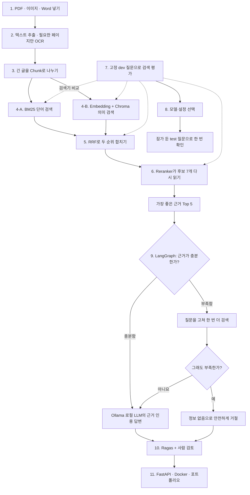

# RAG 전체 작업 지도

> 파일을 넣는 순간부터 근거가 있는 답변을 만들고, 시험하고, 서비스로 내놓기까지의
> 전체 순서입니다.

이 문서는 **가장 먼저 읽는 지도**입니다. 세부 기술 문서는 지금 공부하는 단계가
궁금할 때만 열면 됩니다.

---

## 1. 무엇을 만드는 프로젝트인가요?

사용자가 정부 지원사업 공고문에 관해 질문하면, 관련 문장을 찾아 출처와 함께
답하는 RAG를 만듭니다.

```text
질문: 어떤 회사가 신청할 수 있나요?

답: 대전에 본사, 지사 또는 기업부설연구소가 있는 기업이 신청할 수 있습니다.
근거: ○○ 공고문, 2페이지
```

문서에 답이 없다면 지어내지 않습니다.

```text
제공된 문서에서는 확인할 수 없습니다.
```

RAG는 문서를 AI에게 새로 외우게 만드는 기술이 아닙니다. 질문할 때 필요한
문서 조각을 찾아 AI에게 함께 보여주는 기술입니다.

---

## 2. 전체 로직



### 현재 위치

| 단계 | 상태 | 하는 일 |
|---|---|---|
| 1. 파일 입력 | ✅ | PDF·스캔 PDF·DOCX·이미지 업로드 |
| 2. 텍스트 추출 | ✅ | 일반 문서는 바로 읽고 필요한 페이지만 OCR |
| 3. Chunking | ✅ | 긴 글을 검색하기 좋은 크기로 분할 |
| 4. BM25·Chroma | ✅ | 같은 단어와 같은 뜻을 각각 검색 |
| 5. RRF | ✅ | 두 검색 결과의 순위를 합침 |
| 6. Reranker | ✅ | 후보를 질문과 함께 다시 읽어 정렬 |
| 7. 검색 평가 | ✅ | dev 질문으로 정확도·순위·속도 측정 |
| 8. 검색 설정 확정 | ✅ | 로컬 BGE·후보 7개 고정, test 한 번 완료 |
| 9. LangGraph 답변 | ✅ | 근거 판단·재검색 1회·인용·거절 흐름 |
| 10. Ragas 답변 평가 | ⬜ | 근거와 답변이 맞는지 측정 |
| 11. 서비스·포트폴리오 | ⬜ | FastAPI·Docker·실행 안내 |

현재 **검색 파이프라인은 100%**, 서비스까지 포함한 **전체 포트폴리오는 약
80%** 완료됐습니다.

---

## 3. 완료한 단계는 무슨 일을 하나요?

| 단계 | 12살 비유 | 실제로 하는 일 | 꼭 이해할 것 |
|---|---|---|---|
| 텍스트 추출 | 사진 속 책을 글자로 베끼기 | PDF·DOCX는 직접 읽고 스캔·이미지는 OCR | 추출이 틀리면 검색도 틀림 |
| Chunking | 긴 책을 작은 메모 카드로 나누기 | 문단 우선 700자, overlap 120자 | 너무 작으면 문맥을 잃고 너무 크면 잡음이 늘어남 |
| BM25 | 같은 단어를 찾는 탐정 | Kiwi로 한국어를 나눠 날짜·이메일·사업명 검색 | 정확한 단어에 강함 |
| Embedding | 같은 뜻을 찾는 탐정 | 문장을 숫자로 바꿔 의미가 가까운 글 검색 | 표현이 달라도 뜻이 같으면 찾을 수 있음 |
| Chroma | 숫자 메모를 보관하는 서랍 | 문서 embedding과 metadata 저장·검색 | 답을 만드는 AI가 아니라 Vector Store |
| RRF | 두 탐정의 추천 순위 합치기 | 원점수가 아니라 순위로 BM25·Chroma 결합 | 본문을 읽지 않고 후보 회수에 집중 |
| Reranker | 후보를 직접 읽는 최종 심사위원 | 질문과 후보 본문을 함께 읽어 재정렬 | 후보에 없는 정답은 살릴 수 없음 |
| 검색 평가 | 같은 시험지로 실력 비교 | Hit@k·MRR·nDCG·지연 시간 측정 | 검색 평가와 답변 평가는 다름 |

### 현재 검색 결과

같은 dev normal 20문항에서 reranker 후보 수만 바꿨습니다.

| 후보 수 | Hit@1 | MRR | 평균 지연 | 결정 |
|---:|---:|---:|---:|---|
| 10 | 0.80 | 0.900 | 약 6.28초 | 최초 기준선 |
| **7** | **0.85** | **0.925** | **약 4.20초** | **현재 기본값** |
| 5 | 0.75 | 0.825 | 약 3.25초 | 정답 2개를 잃어 폐기 |

후보 5개는 RRF 6·7위에 있던 정답을 reranker에게 전달하지 못했습니다. 그래서
빠르더라도 선택하지 않았습니다.

후보 7개를 고정하고 모델만 바꾼 결과입니다.

| 모델 | Hit@1 | MRR | 평균 지연 | 최대 프로세스 RSS | 결정 |
|---|---:|---:|---:|---:|---|
| **BGE 568M** | **0.85** | **0.925** | 4513.5ms | 3041.2MB | **품질 우선 기본값 유지** |
| MiniLM 118M | 0.70 | 0.800 | **460.6ms** | **1969.8MB** | 속도 우선 선택지 |

MiniLM은 약 9.8배 빨랐지만 1위 정답률이 떨어지고 `q028` 정답을 5위 안에서도
놓쳤습니다. 자세한 조건과 실패 사례는
[작은 로컬 reranker 비교](../experiments/reranker-model-comparison-dev.md)에
남겼습니다.

---

## 4. 고정 질문은 왜 필요한가요?

매번 다른 시험을 보면 실력이 좋아졌는지 알 수 없습니다. 같은 질문으로 변경
전후를 비교해야 합니다.

```text
전체 36문항
├─ normal 30문항: 문서에 정답이 있음
└─ no-answer 6문항: 문서에 정답이 없음

dev: 설정을 연습하고 고르는 문제
test: 설정을 다 고른 뒤 한 번만 보는 최종 문제
```

### 검색 시험

```text
필요한 근거를 잘 찾았는가?
→ Hit@k, MRR, nDCG, latency
```

### 답변 시험

```text
찾은 근거로 올바르게 답했는가?
→ Ragas + 사람 검토
```

둘은 다른 시험입니다. 지금까지는 검색 시험까지 완성했습니다. test를 개발 중에
반복해서 보면 시험 문제에 맞춰 설정을 고르게 됩니다. 그래서 dev로 설정을 고른 뒤
test normal 10문항을 한 번만 실행했고, 이제 이 결과에 맞춰 검색 설정을 다시
바꾸지 않습니다.

---

## 5. 남은 작업의 정확한 순서

### 5-1. 검색 설정 최종 선택 — 완료

### 할 일

1. 후보 수 7개 고정 — 완료
2. 큰 BGE와 작은 MiniLM을 dev에서 비교 — 완료
3. 외부 reranker API 생략, 로컬 BGE 선택 — 완료
4. BGE + 후보 7개로 검색 설정 고정 — 완료
5. test normal 10문항 검색 평가 한 번 — 완료

### 얻는 것

```text
“유명한 모델이라 선택했다”
아니라
“같은 한국어 질문에서 품질과 지연을 비교해 선택했다”
```

### 완료 기준

- [x] 작은 로컬 모델 비교
- [x] 외부 reranker API를 생략하고 로컬 BGE로 범위 고정
- [x] 최종 검색 설정 고정
- [x] test 검색 평가 한 번

최종 test에서 BGE reranker는 Hit@1 0.80, Hit@3·5 0.90, MRR 0.85였습니다.
`q026`은 자동 평가에서 실패했지만 BM25 1위 결과에 같은 제출 마감일이 있어 실제
답변은 가능한 false negative였습니다. 상세 결과는
[test 검색 평가 리포트](../experiments/retrieval-evaluation-test.md)에 있습니다.

---

### 5-2. LangGraph로 답변·재검색·거절 연결 — 완료

LangGraph는 새로운 검색기가 아닙니다. 이미 만든 검색 단계를 어떤 순서로 실행할지
관리하는 **교통정리 도구**입니다.

12살 비유로는 도서관 사서와 선생님이 함께 일하는 순서입니다.

```text
사서: 질문과 관련된 책 페이지를 찾음
선생님: 이 페이지로 정말 답할 수 있는지 확인
부족함: 질문의 핵심 단어를 고쳐 사서에게 딱 한 번 다시 부탁
충분함: 찾은 페이지 번호를 붙여 답변
여전히 부족함: 아는 척하지 않고 "정보 없음"
```

```text
질문
→ BM25 + Chroma
→ RRF
→ Reranker
→ 근거가 충분한가?
   ├─ 예 → 출처를 인용해 답변
   └─ 아니요 → 질문을 고쳐 한 번 재검색
                 ├─ 근거 발견 → 답변
                 └─ 여전히 부족 → 정보 없음
```

저장할 상태:

- 원래 질문과 고쳐 쓴 질문
- 질문 재작성 횟수
- 찾은 Chunk·점수·파일명·페이지
- 선택한 근거
- 근거 충분성 판정과 이유
- 실행한 node 순서
- 최종 답변 또는 거절 이유

### 실제 코드에서는 어떻게 만들었나요?

| LangGraph 개념 | 이 프로젝트에서 하는 일 |
|---|---|
| State | 질문·현재 검색어·근거·재작성 횟수·답변을 담는 공용 가방 |
| Node | 검색, 근거 판단, 질문 재작성, 답변, 거절 |
| Edge | 한 node가 끝나면 다음 node로 이동하는 길 |
| Conditional edge | 충분하면 답변, 부족하면 재작성 또는 거절로 갈라지는 갈림길 |

`max_rewrites=1`이라 검색이 끝없이 반복되지 않습니다. LLM의 근거 판정 형식이
깨지면 “충분함”으로 추측하지 않고 “부족함”으로 처리합니다. 답변에는 최소 한 개의
`[근거 N]`이 있어야 하며, 존재하지 않는 근거 번호나 인용한 근거에 없는 숫자가
있으면 사용자에게 그 답변을 보여주지 않고 `정보 없음`으로 바꿉니다.

```text
START
→ retrieve
→ assess_evidence
   ├─ 충분함 → answer → END
   ├─ 부족함 + 재작성 전 → rewrite_query → retrieve
   └─ 부족함 + 재작성 완료 → refuse → END
```

구현 파일:

- `src/rag_workflow.py`: State, node, conditional edge, 답변 검증
- `src/local_llm.py`: Ollama 상태 확인과 로컬 Qwen3 호출
- `src/run_rag_workflow.py`: 잠근 BGE 검색기와 그래프를 연결하는 CLI
- `app.py`: 결과를 먼저 보여주고 새 입력은 접어 두는 Streamlit 실행 화면
- `src/rag_trace_ui.py`: 직접 근거·후보 축소·순위 변화·단계별 시간·상세 trace UI
- `tests/test_rag_workflow.py`: 성공·재검색·거절·잘못된 인용 차단 테스트

외부 LLM API 대신 Ollama의 로컬 HTTP API를 사용합니다. 기본 모델은 한국어를
포함한 다국어 지시를 처리하는 `qwen3:4b`이며 `.env`에서 교체할 수 있습니다.
Qwen3의 생각 과정이 질문 재작성이나 근거 판정 결과에 섞이지 않도록 thinking을
끄고, Ollama의 JSON Schema로 각 응답 모양을 고정했습니다. 근거 판정은
`충분한가·이유·근거 답변 초안`을 한 번에 만들고, answer node가 인용 번호와 숫자를
다시 검사합니다. 재작성 결과가 너무 길거나 한글 질문이 아니면 원래 질문을 그대로
사용해 검색 결과가 엉뚱한 영어 추론문에 오염되지 않게 했습니다. 전체 Top-5 판정이
부족하거나 형식을 지키지 못하면 관련성이 높은 상위 3개만 보여주고 한 번 더
확인합니다. 작은 로컬 모델이 주변 근거에 흔들린 한 번의 오판만으로 답변을 버리지
않으면서도, 두 판정이 모두 실패했을 때만 재검색하도록 했습니다. 재작성 결과가 원래
질문과 같다면 같은 검색을 다시 반복하지 않고 중단해 실행 시간을 낭비하지 않습니다.
화면도 같은 우선순위를 따릅니다. 면접관이 먼저 보는 기본 영역에는 답변, 직접 근거,
인용·숫자·의미 근거 판정, 후보가 줄어드는 과정, 최종 근거의 순위 변화와 단계별
시간만 둡니다. 전체 Top-k·전체 Chunk·원점수는 추적이 필요할 때만 펼칩니다. 따라서
서비스 결과와 엔지니어링 관측 정보를 모두 보존하면서도 디버깅 화면이 답변보다 먼저
보이지 않습니다.
서버 중단·모델 미설치·정상 답변은 가짜 HTTP 응답으로 자동 테스트했고, 그래프
분기는 결과가 정해진 가짜 LLM을 주입해 검증했습니다. 실제 로컬 모델의 답변 품질과
no-answer 거절률은 다음 평가 단계에서 측정하며, 아직 좋다고 가정하지 않습니다.

완료 기준:

- [x] 검색 node
- [x] 근거 충분성 판단 node
- [x] 질문 재작성·재검색 node
- [x] 근거 인용 답변 node
- [x] 정보 없음 node
- [x] 성공·재검색·거절 경로 테스트
- [x] Ollama 연결·모델 설치 상태·호출 형식 테스트
- [x] Qwen3 thinking 차단·구조화 출력·잘못된 재작성 질문 차단 테스트
- [x] 전체 근거 판정 실패 시 상위 3개 근거 집중 재확인 테스트
- [x] 재작성 질문이 달라지지 않았을 때 중복 검색 차단 테스트
- [x] 결과 우선 UI·후보 축소·인용 Chunk 순위 변화·단계별 시간 표시
- [ ] 실제 LLM normal·no-answer 품질 평가 — 다음 Ragas 단계

---

### 5-3. Ragas와 사람 검토로 답변 평가

Ragas는 다음을 검사합니다.

| 지표 | 쉬운 뜻 |
|---|---|
| Context Precision | 가져온 근거 중 쓸모 있는 것이 얼마나 많은가? |
| Context Recall | 필요한 근거를 빠뜨리지 않았는가? |
| Faithfulness | 근거에 없는 말을 만들지 않았는가? |
| Answer Relevancy | 질문에 맞는 답을 했는가? |

자동 점수만 믿지 않고 사람이 숫자·날짜·부정 표현·지원 대상·출처 페이지를 함께
확인합니다. no-answer 질문에서는 안전하게 거절했는지도 봅니다.

완료 기준:

- [ ] normal 답변 평가
- [ ] no-answer 거절 평가
- [ ] Ragas 결과표
- [ ] 사람이 확인한 성공·실패 사례
- [ ] 검색 실패와 답변 실패를 분리

---

### 5-4. FastAPI·Docker·포트폴리오 마무리

### FastAPI

다른 프로그램이 RAG에 문서를 넣고 질문할 수 있는 입구를 만듭니다.

```text
POST /documents
POST /questions
GET /health
```

### Docker

다른 컴퓨터에서도 같은 명령으로 실행할 수 있도록 코드와 환경을 상자에 담습니다.

완료 기준:

- [ ] 문서·질문 API와 health check
- [ ] Dockerfile과 환경 변수 예시
- [ ] 처음 보는 사람이 따라 할 실행 안내
- [ ] 실제 평가 수치와 성공·실패 사례
- [ ] 최종 README와 데모 화면

---

## 6. 앞으로 요청할 순서

```text
1. Ragas + 사람 답변 평가
2. FastAPI
3. Docker
4. 최종 README·포트폴리오 정리
```

### 바로 다음 요청 예시

```text
LangGraph 답변을 Ragas와 사람 검토로 평가해줘. normal 질문은 답변 관련성·근거
충실성·출처를 보고, no-answer 질문은 정보 없음 거절 여부를 따로 측정해줘.
검색 실패와 답변 실패도 구분하고 비용이 들기 전 작은 dev 평가부터 실행해줘.
```

---

## 7. 직접 코드를 쳐야 하나요?

직접 모든 코드를 입력할 필요는 없습니다. AI에게 구현·테스트·문서화를 맡길 수
있습니다. 대신 다음은 이해하고 확인해야 합니다.

| AI에게 맡겨도 되는 것 | 직접 이해할 것 |
|---|---|
| 반복 코드와 연결 코드 | 각 단계가 왜 필요한가? |
| 자동 테스트 | 입력과 출력은 무엇인가? |
| 실험 실행과 결과표 초안 | 무엇을 고정하고 무엇만 바꿨는가? |
| 오류 처리와 문서 초안 | 숫자가 달라진 이유와 실패 사례는 무엇인가? |

면접에서는 코드를 외우는 것보다 다음 흐름을 설명하는 것이 중요합니다.

```text
문제
→ 기준선
→ 한 가지 변경
→ 숫자와 실패 사례
→ 선택한 결정
```

---

## 8. 꼭 이해할 10가지

1. RAG는 문서를 모델에게 새로 학습시키는 것이 아닙니다.
2. 추출이 틀리면 뒤 단계도 틀릴 수 있습니다.
3. Chunk 크기는 데이터로 비교할 설정입니다.
4. BM25는 같은 단어, embedding은 같은 뜻을 찾습니다.
5. Chroma는 embedding을 저장하고 검색하는 Vector Store입니다.
6. RRF는 서로 다른 원점수 대신 순위를 합칩니다.
7. Reranker는 후보만 다시 읽으며 후보에 없는 정답은 살리지 못합니다.
8. 검색 평가와 최종 답변 평가는 다릅니다.
9. dev는 설정 선택용이고 test는 최종 확인용입니다.
10. 좋은 RAG는 모를 때 근거 없이 대답하지 않습니다.

---

## 9. 포트폴리오 완료 체크

- [x] 다양한 문서에서 텍스트를 추출할 수 있다.
- [x] Chunk를 나눈 기준을 설명할 수 있다.
- [x] BM25·Chroma·RRF·reranker의 차이를 설명할 수 있다.
- [x] 같은 질문으로 변경 전후를 숫자로 비교했다.
- [x] test를 설정 선택에 반복 사용하지 않았다.
- [x] 답변에 파일과 페이지 근거가 표시된다.
- [x] 근거가 없으면 안전하게 거절한다.
- [x] 검색 실패와 답변 실패를 구분한다.
- [x] 다른 사람이 README만 보고 실행할 수 있다.
- [ ] 성공뿐 아니라 실패와 다음 개선점도 설명한다.

---

## 10. 1분 면접 설명

> 한국어 정부 지원사업 공고문에서 근거를 찾아 인용하고, 근거가 없으면 거절하는
> RAG를 만들고 있습니다. PDF·DOCX·이미지에서 페이지별 텍스트를 추출하고 문단
> 우선 Chunk로 나눈 뒤, Kiwi BM25와 multilingual E5/Chroma로 키워드·의미
> 후보를 찾습니다. 서로 다른 점수는 직접 더하지 않고 RRF로 순위를 합치며,
> 상위 7개는 다국어 CrossEncoder로 재정렬합니다. 36문항 골든셋을 dev와 test로
> 분리해 Hit@k, MRR, nDCG와 지연을 측정했습니다. 후보 10개에서 7개로 줄였을 때
> dev Hit@1은 0.80에서 0.85로 유지·개선됐고 평균 지연은 약 6.28초에서 4.20초로
> 줄었습니다. 후보 5개는 정답 두 개를 잃어 채택하지 않았습니다. 작은 MiniLM은
> 약 9.8배 빨랐지만 Hit@1이 0.70으로 떨어져 BGE를 유지했습니다. 외부 reranker
> API는 생략했습니다. 로컬 BGE + 후보 7개로 test를 한 번 실행해 Hit@1 0.80,
> MRR 0.85를 확인했고 검색
> 설정을 잠갔습니다. LangGraph에는 검색, 근거 충분성 판정, 질문 재작성과 재검색
> 1회, 인용 답변, 정보 없음 거절 node를 연결했습니다. 잘못된 인용 번호와 근거에
> 없는 숫자는 fail-closed로 거절하며 성공·재검색·거절 경로를 자동 테스트했습니다.
> 다음은 Ragas와 사람 검토로 실제 답변과 no-answer 거절 품질을 측정합니다.

---

## 11. 세부 문서는 언제 읽나요?

처음부터 전부 읽지 않습니다.

```text
전체 순서와 남은 일이 궁금하다 → 이 문서
현재 단계의 원리를 공부한다 → 해당 세부 문서 하나
실제 숫자와 결정 근거를 본다 → experiments 비교 리포트
```

| 궁금한 것 | 문서 |
|---|---|
| 파일 추출·OCR | [INGESTION.md](INGESTION.md) |
| Chunking | [CHUNKING.md](CHUNKING.md) |
| BM25 | [BM25.md](BM25.md) |
| Embedding·Chroma | [VECTOR_SEARCH.md](VECTOR_SEARCH.md) |
| RRF | [RRF.md](RRF.md) |
| Reranker | [RERANKER.md](RERANKER.md) |
| 고정 질문과 검색 평가 | [EVALUATION.md](EVALUATION.md) |
| 현재 검색 결과 | [retrieval-evaluation-dev.md](../experiments/retrieval-evaluation-dev.md) |
| 후보 수 선택 근거 | [reranker-candidate-comparison-dev.md](../experiments/reranker-candidate-comparison-dev.md) |

앞으로 한 단계가 끝날 때마다 이 문서의 **현재 위치 표와 남은 체크리스트만**
갱신합니다.

LangGraph의 State·node·edge와 조건부 분기는
[공식 Graph API 안내](https://docs.langchain.com/oss/python/langgraph/graph-api)와
[공식 workflow 안내](https://docs.langchain.com/oss/python/langgraph/workflows-agents)를
기준으로 구현했습니다.
